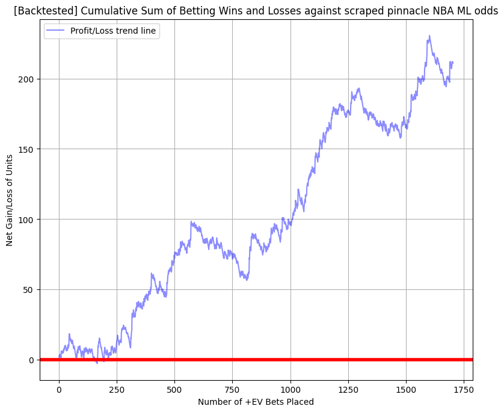

# NBA_Betting_Model_Results

# Profitable-Sports-Betting-Model-Results
This repo shows the results/profitability of my NBA Moneyline sports betting model created in R, C++, and Python that quantifies and calibrates a probabilistic signal within the entirety of an NBA team's seasons performance history. This model consistently achieves around 10% ROI. In this repo I show the end results of using a machine learning algorithm to generate game win probabilities and exploit those probabilities to place long-term profitable money line wagers. (ie positive EV betting). I also demonstrate validity and trustworthiness of the algorithm through A) hypothesis testing of the model's outputs as well as B) repeated back testing on real sportsbooks odds to confirm that the model is indeed profitable. Please note that this repo shows ONLY THE RESULTS of the model and NOT THE FEATURE ENGINEERING PROCESS. All of the analysis and back testing was performed on a randomly selected 20% subset (test data) of the entire dataset with the remaining 80% (training data) being used to train and calibrate the model and it's hyperparameters. All feature engineering processes generated lagged variables for inputs to prevent data leakage (meaning all inputs used in this model are available before available betting lines close). Models I have made for other markets (MLB-runline/moneyline, NFL, etc) have returned similar results.  

## Explanation of the Files in this Repository:

### Model_training.py
This is a python code chunk showing the splitting of the dataset into train and test sets. 20% of the data (roughly 1700-2500 games) was used for a test set where all validation/back testing was done while the remaining 80% was used to train the model. Hyperparameters and model specifics are not yet disclosed in this repo but may be at a later time.

```
# =============================================================================================================================================
'''  Creating train test data splits '''
# ===============================================================================================================================================

# Split data into features (X) and labels (y)
X = df.drop('col_1', axis=1)  # Features
y = df['col_1']  # Target

# Split the data into training and test sets (80% train, 20% test)
x_train, x_test, y_train, y_test = train_test_split(X, y, test_size=0.2) # test_size has approximately 3550 samples.

# sportsbooks odds = implied probabilities
x_test_sportsbooks_odds = x_test['col_39']

x_train_sportsbooks_odds = x_train['col_39']

x_test = x_test.drop('col_39', axis = 1)

x_train = x_train.drop('col_39', axis = 1)

# Train the model
my_classifier_model.fit(x_train, y_train)

# Make predictions on the test set
y_pred = my_classifier_model.predict(x_test)

# Evaluate the model
accuracy = accuracy_score(y_test, y_pred)
print(f"Accuracy: {accuracy * 100:.2f}%")
```

### Model_output_Regression_Curve.png
The model produces probabilities that provide us a measure of the model's confidence/certainty in its predictions. If the probability is greater than .5 it predicts the team will win while if the probability is less than .5 it predicts the team will lose. Probabilities closer to 1 or 0 reflect a higher level of confidence in a team winning or losing respectively. In order to confirm that the model's probabilities accurately reflect the expected frequency of teams winning or losing I conducted a logistic regression of the model's predictions for the test set against the true outcome for every game in the test dataset. After running a logistic regression I plotted the model's probabilities on the x-axis and partition the teams that won from those that lost on the y-axis (ie points distributed around 1 (top) means the team won that game, while points distributed around 0 (bottom) means the team lost). We see that the model's predicted probabilities (black line) straddle the line y=x (blue line). This confirms that the model is well-calibrated and produces probabilities that truly reflect a team's likelihood of winning. We also notice that the model is very conservative in its predictions as the model rarely produces a probability greater than .82 or less than .09. I confirm during profit testing against real data that this is non-problematic to generating profitable picks. 

.png)

### Reliability/Calibration Curve
This visual shows the calibration curve of the model on the test set which serves as further validation of calibration. Test set observations are "binned" into groups with similar predicted probabilities with the average probability of each bin given on the x-axis. The true proportion of win/losses for each group is given by each data point's y coordinate. 

.png)

### Model_Prediction_logistic_Regression.png
This is the output from running a logistic regression of the model's predicted probabilities against the true binary outcomes of the test data set. We first see that the model obtains a 63% raw accuracy which is statistically significant since our test set is indeed balanced at approx 50% win/lose teams. I focus on the p-value of the coefficient for the model's predictions which is .000 (approx 0) allowing me to reject the hypothesis that my model has no statistical significance in predicting game winners and accept the alternative (i.e. I can trust that the model has predictive power).  

.png)

### Betting_Model_vs_Sportsbooks_plots.png
Looking strictly at the test dataset I plotted my model's output probabilities on the x-axis and the scraped sportsbook's implied probabilities on the y-axis. We see that my model's output is highly correlated to the sportsbooks implying that my model is finding a strong signal in the data's noise. Nonetheless running a logistic regression analysis of the sportsbooks odds showed their implied probabilities do indeed obtain a lower log loss than my model (this is expected and due to vigorish/juice/"fee" charged by all sportsbooks). This does not impede my model from generating positive expected value picks (ie a positive ROI) since the variance of odds within the betting market is almost always greater than zero. The black line in the image is the line y=x, it is not a linear regression line. Only games below the black line are considered to be bet on, as games above the line do not have a model implied probability that has positive expectation relative to the sportsbook's odds. 


### Profit_testing_on_adjusted_odds.py
I converted the book's implied probabilities for each game, to the percentage of wager returned upon a win assuming a Flat_bet strategy (ex +150 means 150% of bet is returned upon a win while -130 is 77% of wager returned). Since a loss results in losing the entire wager its return would be -100%. I made a small (but significant) adjustment to the odds by accounting for the value that can be found by “line shopping” and exploiting differing odds offered on different sportsbooks apps in Las Vegas (i.e. CIRCA, WESTGATE, MGM, CAESARS, WILLIAM HILL, STN, BOYD etc.). Only games where my model implies a higher win likelihood than the implied probability of at least one sportsbook are considered. For each game where the selected team wins, the corresponding proportion of the wager returned is added to my bankroll, while for every incorrect prediction made by the model the entire wager (1 unit) is subtracted. Finally the cumulative sum of the changes are plotted and the final total change in bankroll is calculated. ROI is calculated as total profit (or loss) of units divided by the total number of bets placed. 

```
from matplotlib.colors import ListedColormap


#=============================================================================== Plot generating code
y_1 = x_test_
x_1 = model_fitted_calibrated

cmap = ListedColormap(['red', 'blue'])

plt.scatter(x_1,y_1,marker = 'o', c = y_test, s= 12 , cmap = cmap, alpha=.244)
plt.grid(True, which='both', axis='both', linestyle='--', color='gray', alpha=0.3)
plt.minorticks_on()  # Enable minor gridlines

legend_labels = [' ']
legend_colors = ['blue']  # The colors corresponding to the binary categories

# Add gridlines for both major and minor ticks
plt.grid(True, which='minor', axis='both', linestyle=':', color='blue', alpha=0.3)  # Minor gridlines
plt.axhline(y=0.5, color='black', linestyle='--', label='y = 0.5',alpha = .65)
plt.axvline(x=0.5, color='black', linestyle='--', label='x = 0.5',alpha = .65)
plt.axvline(x=0.2, color='pink', linestyle='-', label='x = 0.18',alpha = .95)
plt.axvline(x=0.8, color='pink', linestyle='-', label='x = 0.82',alpha = .95)

slope = 1
intercept = 0
# Create an array of x-values (from -10 to 10)
line_x_values = np.linspace(0.15, .85, 200)

# Compute corresponding y-values using y = mx (since the intercept is 0)
line_y_values = slope * line_x_values + intercept

# Create a plot
plt.plot(line_x_values, line_y_values, label=f'Line: y = {slope}x', color='black')
plt.xlabel('My_Model\'s_projected_win_probability')
plt.ylabel('Pinnacle/Circa_implied_win_probability(w/vigorish)')
plt.title('Vegas Sports books vs betting model')

plt.text(0.5, 1, 'Public favorites', fontsize=9, color='black', ha='center')
plt.text(0.5, .05, 'Public underdogs', fontsize=9, color='black', ha='center')

plt.text(0.09, .95, 'Blue dots = Game Won', fontsize=7, color='blue', ha='center')
plt.text(0.09, .9, 'Red dots = Game Lost', fontsize=7, color='red', ha='center')


plt.xlim(0.18,.85)
plt.ylim(0,1)

plt.axis('equal')
# Show the plot
#===============================================================================
plt.show()

#===============================================================================  Profit-testing begins here
df = pd.DataFrame({
    'model_predicted_prob': x_1,
    'pinnacle_implied_probability': y_1,
    'binary_outcome_win_loss': y_test

})

# Placing bets where the model provides a stronger implied probability than the sportsbooks is the foundation of 
# positive EV betting....

df = df[df['model_predicted_prob'] > (df['pinnacle_implied_probability'])]

# Vegas sportbetting apps offer different pre-game odds so value can be found
# by exploiting the market generated by different betting apps (Circa, Westgate, MGM, William Hill, etc). Some apps offter
# an implied probability differential between 0 and .03 with some differences being up to .05
line_shopped_value = .02 # <- should be between 0 and .02 but can be up to .05
df['percentage_of_wager_returned'] = my_odds_to_payout_function(df['pinnacle_implied_probability'])

wager = 1 # <- unit amount bet

df['net_change_from_wager'] = np.where(df['binary_outcome_win_loss'] == 1, wager*df['percentage_of_wager_returned'], (-1)*wager)

print("Net gain or loss is :: ", df['net_change_from_wager'].sum())

df['cumulative_sum'] = df['net_change_from_wager'].cumsum()

row_numbers = range(1, len(df) + 1)
plt.figure(figsize=(12, 6))

plt.plot(row_numbers, df['cumulative_sum'], color='b',alpha = .45, linestyle='-', label="Profit/Loss trend line")

plt.title('[Backtested] Cumulative Sum of Betting Wins and Losses against scraped pinnacle NBA ML odds')
plt.xlabel('Number of +EV Bets Placed')
plt.ylabel('Net Gain/Loss of Units')
plt.legend()
plt.grid(True)
plt.axhline(y=0, color='red', linewidth=4)

plt.show()
raise SystemExit()

```

### Positive_ROI.png
Positive ROI of between 9-12% is obtained after ~1500 bets. Again by placing bets at different locations and STRICTLY placing bets ONLY where my model provides a higher implied probability than the sportsbooks I am able to overcome the vig. Since a Flat-bet betting strategy was employed here, this ROI likely represents a minimum of potential ROI, as increased profits will probably be actualized under a fractional-Kelly-criterion betting strategy however at the tradeoff of much higher volatility/larger swings.  Repeated testing on different subsets of randomly selected test data returns similar results! Profitability is concluded. 


